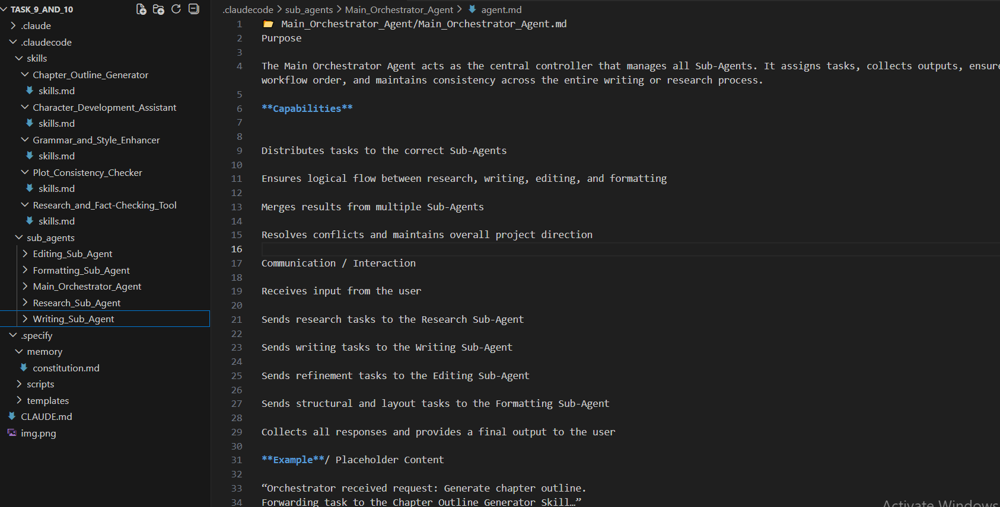

# 📘 Claude Code Project – Sub-Agents & Skills Overview

This project is structured using **Claude Code Router (CCR)**, following a modular system of **Sub-Agents** and **Skills**.
Each Sub-Agent and Skill performs a unique, isolated task and communicates through the **Main Orchestrator Agent** to produce polished, consistent output.

---

## 🧩 Sub-Agents (Definitions)

### **1. Main Orchestrator Agent**

The central controller responsible for coordinating all Sub-Agents and Skills.
It assigns tasks, merges outputs, ensures workflow order, and delivers the final response.

### **2. Research Sub-Agent**

Handles information gathering, fact-checking, summaries, and background research.
Supports writing and editing through validated and structured knowledge.

### **3. Writing Sub-Agent**

Creates all narrative, creative, and structural draft content.
Receives outlines and research, and produces chapters, scenes, or documentation.

### **4. Editing Sub-Agent**

Improves clarity, grammar, tone, and flow of writing.
Ensures consistency, removes redundancy, and enhances readability.

### **5. Formatting Sub-Agent**

Applies formatting (Markdown, structure, headings, layout).
Prepares final documents for export, readability, and publishing.

---

## 🛠️ Skills (Definitions)

### **1. Chapter Outline Generator**

Creates structured story or document outlines, including chapter breakdowns and progression paths.

### **2. Character Development Assistant**

Builds detailed character profiles, motivations, arcs, and personality traits for writing projects.

### **3. Plot Consistency Checker**

Identifies inconsistencies in timelines, logic, character actions, or worldbuilding.

### **4. Research & Fact-Checking Tool**

Validates information, checks accuracy, provides sources, and ensures factual reliability.

### **5. Grammar & Style Enhancer**

Improves grammar, tone, vocabulary, sentence structure, and overall writing style.

---

## 📁 Project Structure (Summary)

```
.claudecode/
│
├── Sub-Agents/
│   ├── Main_Orchestrator_Agent/
│   ├── Research_Sub_Agent/
│   ├── Writing_Sub_Agent/
│   ├── Editing_Sub_Agent/
│   └── Formatting_Sub_Agent/
│
└── Skills/
    ├── Chapter_Outline_Generator/
    ├── Character_Development_Assistant/
    ├── Plot_Consistency_Checker/
    ├── Research_and_Fact_Checking_Tool/
    └── Grammar_and_Style_Enhancer/
```

---

## 📄 Purpose of This Project

This Claude Code system is designed to enable:

* Modular writing automation
* AI-assisted research and content creation
* Consistency checks across long documents
* Clean, formatted output
* Highly structured and scalable workflows

Each Sub-Agent and Skill works as a separate intelligent unit, orchestrated by the central agent.

---

